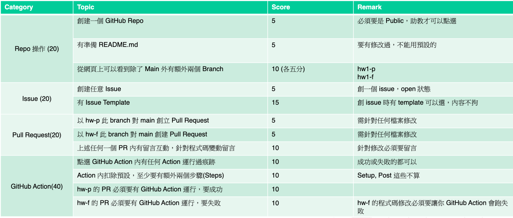

> Revised from [My Django + AWS RDS PostgreSQL Learning Project](https://github.com/wama-tw/Django-Learn)
> 這是一份關於 GitHub Action 的作業 @台積電在台大上的課「雲原生應用程式開發」
> 作業要求
> 


# Django 與快速入門指南

本文檔提供了 Django 項目創建和配置的步驟指南。這將幫助團隊成員快速了解環境設置和當前進度。

## 1. 設置 Django 環境

首先，我們需要創建一個虛擬環境並安裝 Django：

```bash
# 創建一個名為 django-learn 的虛擬環境，使用 Python 3.12
conda create -n django-learn python=3.12

# 激活虛擬環境
source activate django-learn

# 安裝 Django 框架
pip install django

# 確認 Django 版本
python -m django --version
```

## 2. 創建 Django 項目

在環境設置好後，我們創建並啟動一個新的 Django 項目：

```bash
# 創建一個名為 django101 的新項目
django-admin startproject django101

# 進入項目目錄
cd django101

# 創建一個名為 myapp 的應用
python manage.py startapp myapp

# 完成 urls.py 和 views.py 的編輯後，啟動開發服務器
python manage.py runserver
```

## 3. 數據庫遷移與管理

完成數據庫配置後，我們需要執行遷移命令以創建數據庫結構：

```bash
# 創建遷移文件
python manage.py makemigrations

# 應用遷移，更新數據庫結構
python manage.py migrate

# 創建管理員用戶，用於訪問 Django 管理界面
python manage.py createsuperuser
```

## 後續步驟

1. **完善模型設計**：在 `models.py` 中定義您的數據模型
2. **創建視圖和模板**：設計用戶界面和交互邏輯
3. **部署準備**：考慮使用 AWS Elastic Beanstalk 或 EC2 部署應用

## 注意事項

- 請勿將敏感信息直接硬編碼在代碼中
- 確保 `.env` 或其他配置文件已添加到 `.gitignore` 列表
- 在生產環境中，設置 `DEBUG = False`
- 考慮為不同環境（開發、測試、生產）使用不同的設置文件
- 新加入項目的團隊成員應該使用 `.env.example` 作為模板創建自己的 `.env` 文件，並填入正確的數據庫連接信息
